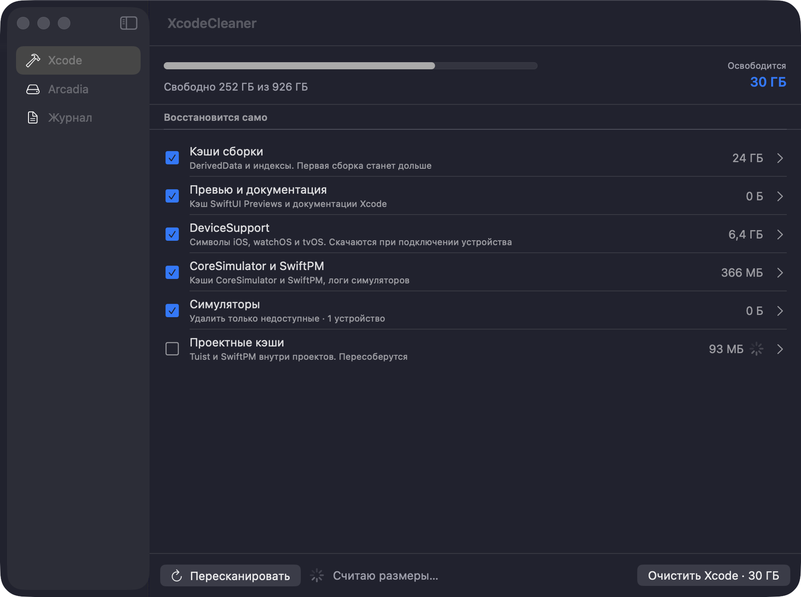
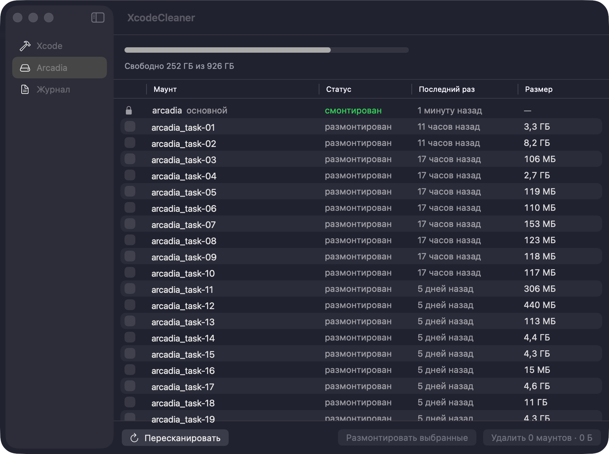

# XcodeCleaner

macOS-приложение для очистки Xcode, симуляторов и маунтов Arcadia.
Показывает, сколько занимает каждая категория, и объясняет, что вы потеряете,
если её удалить.



## Зачем

Xcode копит десятки гигабайт в `DerivedData`, `DeviceSupport` и кэшах
симуляторов. Отдельная беда — маунты Arcadia: после `arc unmount` их store
остаётся на диске и занимает гигабайты, а по имени папки уже не понять,
нужен маунт или нет.

Приложение собирает всё это в один список с размерами и датами последнего
использования, чтобы решение принималось за минуту.

## Требования

- macOS 15 и новее
- Xcode с командными инструментами: `xcrun`, `xcodebuild`, `xcode-select`
- `arc` в `PATH` — только для вкладки Arcadia; без него остальное работает

## Сборка

```
./build.sh
```

Скрипт собирает release-бинарь через SwiftPM, упаковывает его в
`XcodeCleaner.app`, подписывает ad-hoc и кладёт готовое приложение на рабочий
стол. Xcode-проект не нужен и не создаётся. Полная сборка с нуля занимает
около 15 секунд.

Запуск: двойной клик по `~/Desktop/XcodeCleaner.app`.

## Как пользоваться

### Вкладка Xcode

Одна строка — одна категория. Под названием написано, чем обернётся удаление.
Справа размер, стрелка раскрывает конкретные папки внутри категории с
отдельными галочками. Пути показываются во всплывающей подсказке, чтобы не
загромождать список.

Категории разделены на две группы. **Восстановится само** — кэши, которые
пересоберутся при следующей сборке. **Не восстановится автоматически** —
архивы, старые версии Xcode и toolchains; они помечены оранжевым
треугольником и уходят в Корзину, откуда их можно вернуть.

Две категории настраиваются. У симуляторов есть режим: удалить только
недоступные, стереть данные всех, удалить все устройства или ещё и скачанные
runtimes. У архивов — порог возраста в днях.

Кнопка внизу действует только на текущую вкладку и показывает суммарный
размер выбранного. Перед удалением появляется список того, что будет удалено,
с отдельной галочкой подтверждения для необратимых пунктов.

### Вкладка Arcadia



Список маунтов с колонками «Статус», «Последний раз» и «Размер». Дата берётся
из времени изменения служебных данных внутри store, поэтому отражает реальную
работу с веткой, а не момент создания маунта.

Основной маунт `~/arcadia` показан с замком и не выбирается.

«Удалить выбранные» снимает всё, что связано с маунтом: размонтирует его,
если нужно, убирает из реестра `arc` и удаляет store. Устаревший статус в
списке `arc` не мешает удалению.

### Вкладка Журнал

Вывод выполняемых команд построчно. Файл каждого прогона сохраняется в
`~/Desktop/Xcode Cleanup Logs/`.

## Что приложение не тронет

- Основной маунт `~/arcadia` — защищён тремя независимыми проверками
- Активный Xcode, выбранный через `xcode-select`
- `swift-latest.xctoolchain` и toolchain, на который он указывает
- Всё, чего нет в allowlist: удаление возможно только по точному совпадению
  пути со списком известных папок-кэшей, симлинки отклоняются

Архивы, версии Xcode и toolchains уходят в Корзину и восстановимы. Store
маунта Arcadia удаляется мимо Корзины и не восстановится — приложение
предупреждает об этом отдельно.

Перед очисткой проверяется, что Xcode, Simulator и сборочные процессы не
запущены; иначе очистка не начнётся.

## Разработка

```
swift build              # собрать
swift run XcodeCleaner   # запустить без упаковки в .app
swift test               # 149 тестов, около секунды
```

Для работы в Xcode откройте `Package.swift` — Xcode понимает SwiftPM-пакет
напрямую, генерировать проект не нужно.

Иконка лежит в `Assets/AppIcon.png` и генерируется скриптом
`swift Assets/make-icon.swift`. `build.sh` подхватывает её автоматически.

### Структура

- `Sources/XcodeCleanerCore` — вся логика: сканирование, подсчёт размеров,
  безопасное удаление, работа с `simctl` и `arc`. Не зависит от SwiftUI.
- `Sources/XcodeCleaner` — приложение: `AppModel` и SwiftUI-вьюхи.
- `Tests/XcodeCleanerCoreTests` — тесты ядра. Внешние команды подменяются
  фейком, реальные `arc` и `simctl` в тестах не вызываются.

### Как устроено сканирование

Сканирование двухфазное. Сначала строится структура без обхода дерева, список
появляется примерно за 0,7 секунды. Затем размеры считаются параллельно и
подставляются в строки по мере готовности; полный подсчёт на большой машине
занимает около полуминуты, но список всё это время уже виден и кликабелен.

## Подробности

Спецификация: `docs/superpowers/specs/2026-09-09-xcode-cleaner-design.md`.
