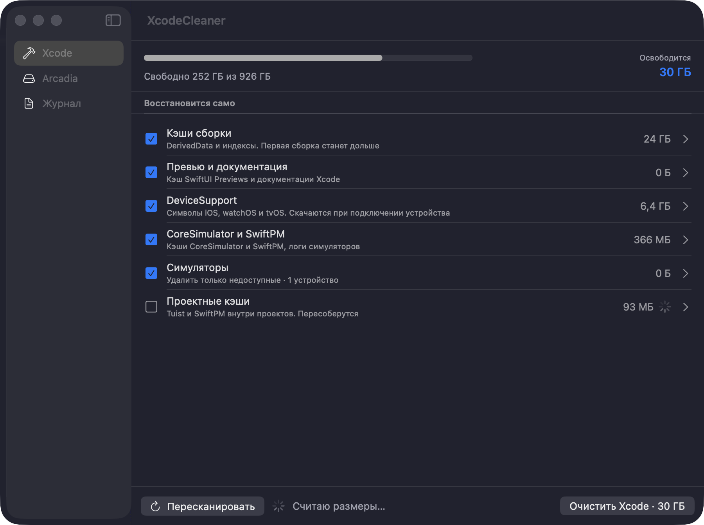
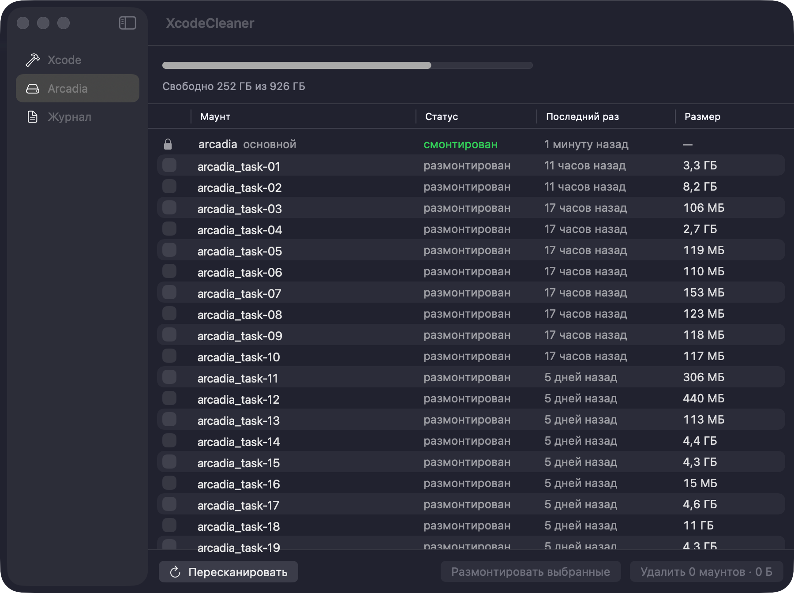

# XcodeCleaner

macOS-приложение для очистки Xcode, симуляторов и маунтов Arcadia.
Показывает, сколько занимает каждая категория, и объясняет, что вы потеряете,
если её удалить.



## Зачем

Xcode копит десятки гигабайт в `DerivedData`, `DeviceSupport` и кэшах
симуляторов. Отдельная беда — маунты Arcadia: после `arc unmount` их store
остаётся на диске и занимает гигабайты, а по имени папки уже не понять,
нужен маунт или нет.

Приложение собирает всё это в один список с размерами и датами последнего
использования, чтобы решение принималось за минуту.

## Требования

- macOS 15 и новее
- Xcode с командными инструментами: `xcrun`, `xcodebuild`, `xcode-select`
- `arc` в `PATH` — только для вкладки Arcadia и поиска в маунтах; без него
  остальное работает, включая поиск в других папках

## Как собрать

Нужен только Swift-тулчейн, который идёт вместе с Xcode. Отдельный
Xcode-проект не нужен и не создаётся.

**1. Склонировать репозиторий**

```bash
git clone git@github.com:OsmaevRSH/XcodeCleaner.git && cd XcodeCleaner
```

**2. Собрать**

```bash
./build.sh
```

Скрипт делает четыре шага: собирает release-бинарь через SwiftPM, складывает
его в `XcodeCleaner.app` вместе с `Info.plist` и иконкой, подписывает бандл
ad-hoc и копирует готовое приложение на рабочий стол, перезаписывая прошлую
версию. В конце он печатает путь к результату.

Сборка с нуля занимает около 9 секунд, повторная — пару секунд.

**3. Запустить**

Двойной клик по `~/Desktop/XcodeCleaner.app`.

### Если что-то пошло не так

`xcrun: error: unable to find utility` — не выбран Xcode. Проверьте
`xcode-select -p` и при необходимости укажите путь:

```bash
sudo xcode-select -s /Applications/Xcode.app
```

Приложение подписано ad-hoc, то есть без сертификата разработчика. На той же
машине, где оно собрано, это не мешает. Если скопировать `.app` на другой Mac,
macOS откажется его открывать по двойному клику — там нужно один раз открыть
его через контекстное меню, пункт «Открыть». Проще собрать на месте.

Вкладка Arcadia остаётся пустой, если `arc` не найден в `PATH`. Причина
пишется в журнал; остальные вкладки при этом работают.

## Как пользоваться

### Вкладка Xcode

Одна строка — одна категория. Под названием написано, чем обернётся удаление.
Справа размер, стрелка раскрывает конкретные папки внутри категории с
отдельными галочками. Пути показываются во всплывающей подсказке, чтобы не
загромождать список.

Категории разделены на две группы. **Восстановится само** — кэши, которые
пересоберутся при следующей сборке. **Не восстановится автоматически** —
архивы, старые версии Xcode и toolchains; они помечены оранжевым
треугольником и уходят в Корзину, откуда их можно вернуть.

Две категории настраиваются. У симуляторов есть режим: удалить только
недоступные, стереть данные всех, удалить все устройства или ещё и скачанные
runtimes. У архивов — порог возраста в днях.

Кнопка внизу действует только на текущую вкладку и показывает суммарный
размер выбранного. Перед удалением появляется список того, что будет удалено,
с отдельной галочкой подтверждения для необратимых пунктов.

#### Папки `.build` внутри проектов

`swift build` оставляет папку `.build` рядом с каждым `Package.swift`, и
фиксированным списком путей их не перечислить: в одном маунте их набирается
на гигабайты. Приложение ищет их само и добавляет найденное в категорию
«Проектные кэши». Поиск идёт в фоне, уже после того как список появился,
поэтому строки добавляются на ходу; пока он идёт, у категории крутится
индикатор, а внизу написано «Ищу проектные кэши…».

Где искать, задаётся в листе «Где искать проектные кэши» — он открывается
шестерёнкой в левом нижнем углу окна. В нём два раздела.

**В маунтах Arcadia.** Приложение обходит смонтированные маунты, в каждом —
заданные корни проектов, по умолчанию `mobile/saft/ios` и `mobile/music/ios`.
Корни пишутся в поле по одному в строке, от корня маунта: `mobile/saft/ios`
означает `~/arcadia/mobile/saft/ios`. Под полем видно, сколько корней
получилось и что из введённого отброшено: строка, в которой нет пути, и путь
с `..`, уводящий за пределы маунта. «Сбросить» возвращает в поле встроенные
пути, но сам ничего не сохраняет. Пустой список — разрешённый ответ, он
означает «искать по встроенным путям». Найденное называется по маунту:
`arcadia · mobile/saft/ios/Tuist/.build`.

**Другие папки.** Любые папки на диске — так приложение полезно и на машине
без Arcadia. Папки добавляет кнопка «Добавить папку…»: она открывает обычное
окно выбора, можно отметить несколько сразу. Кнопка с минусом в строке
убирает папку из списка. Весь диск и системные папки (`/System`, `/Library`,
`/Applications`, `/usr`, `/private`, `/bin`, `/sbin`, `/opt`) не добавляются,
причина пишется красным. Папка, которой сейчас нет, — например, на
отключённом диске — остаётся в списке, а при сканировании пропускается с
предупреждением в журнале. Найденное называется по пути, домашняя папка
сокращается до `~`: `~/Developer/MyLib/.build`.

В первый раз, когда приложение читает Рабочий стол, Документы или Загрузки,
macOS может спросить разрешение. Без него поиск в этих папках ничего не
найдёт.

«Сохранить» применяет оба раздела сразу: сканирование перезапускается,
перезапуск приложения не нужен.

Обход одинаково ограничен в обоих случаях. Глубина — не больше восьми
уровней, симлинки не раскрываются, а `node_modules`, `DerivedData`, `.git`,
бандлы вроде `.xcodeproj` и в домашней папке `~/Library` и `~/.Trash`
пропускаются целиком. Сверх этого действуют два правила безопасности:

- Папка `.build` засчитывается, только если рядом с ней лежит файл
  `Package.swift`: в произвольной папке `.build` может принадлежать чему
  угодно, а очистка удаляет её содержимое.
- Обход не переходит на другую файловую систему, поэтому поиск, начатый в `~`,
  не заходит в маунты Arcadia, на сетевые и внешние диски; папка, которая сама
  лежит на внешнем диске, обходится целиком.

На каждую папку и каждый корень отводится 30 секунд. Если время вышло, поиск
в ней останавливается, в журнал пишется «Поиск в <путь> остановлен через
30 с — укажите папку точнее», а остальные папки обходятся дальше.

Оба списка лежат в `UserDefaults`, поэтому их можно выставить и скриптом:

```bash
defaults write dev.ltheresi.xcodecleaner ProjectSearchRoots -array "mobile/saft/ios" "mobile/music/ios"
defaults write dev.ltheresi.xcodecleaner ProjectSearchFolders -array "~/Developer" "/Volumes/Work"
```

Записанное таким образом проходит те же проверки, что и выбранное в окне, и
читается при запуске. Вернуть встроенные корни: `defaults delete
dev.ltheresi.xcodecleaner ProjectSearchRoots`.

### Вкладка Arcadia



Список маунтов с колонками «Статус», «Последний раз» и «Размер». Дата берётся
из времени изменения служебных данных внутри store, поэтому отражает реальную
работу с веткой, а не момент создания маунта.

Основной маунт `~/arcadia` показан с замком и не выбирается.

«Удалить выбранные» снимает всё, что связано с маунтом: размонтирует его,
если нужно, убирает из реестра `arc` и удаляет store. Устаревший статус в
списке `arc` не мешает удалению.

### Вкладка Журнал

Вывод выполняемых команд построчно. Файл каждого прогона сохраняется в
`~/Desktop/Xcode Cleanup Logs/`.

## Что приложение не тронет

- Основной маунт `~/arcadia` — защищён тремя независимыми проверками
- Активный Xcode, выбранный через `xcode-select`
- `swift-latest.xctoolchain` и toolchain, на который он указывает
- Всё, чего нет в allowlist: удаление возможно только по точному совпадению
  пути со списком известных папок-кэшей, симлинки отклоняются

Архивы, версии Xcode и toolchains уходят в Корзину и восстановимы. Store
маунта Arcadia удаляется мимо Корзины и не восстановится — приложение
предупреждает об этом отдельно.

Перед очисткой проверяется, что Xcode, Simulator и сборочные процессы не
запущены; иначе очистка не начнётся.

## Разработка

```
swift build              # собрать
swift run XcodeCleaner   # запустить без упаковки в .app
swift test               # 228 тестов, около секунды
```

Для работы в Xcode откройте `Package.swift` — Xcode понимает SwiftPM-пакет
напрямую, генерировать проект не нужно.

Иконка лежит в `Assets/AppIcon.png` и генерируется скриптом
`swift Assets/make-icon.swift`. `build.sh` подхватывает её автоматически.

### Структура

- `Sources/XcodeCleanerCore` — вся логика: сканирование, подсчёт размеров,
  безопасное удаление, работа с `simctl` и `arc`. Не зависит от SwiftUI.
- `Sources/XcodeCleaner` — приложение: `AppModel` и SwiftUI-вьюхи.
- `Tests/XcodeCleanerCoreTests` — тесты ядра. Внешние команды подменяются
  фейком, реальные `arc` и `simctl` в тестах не вызываются.
- `Tests/XcodeCleanerTests` — тесты приложения: чтение и запись настроек в
  `UserDefaults`. Тест работает в отдельном сьюте, домен приложения не трогает.

### Как устроено сканирование

Сканирование двухфазное. Сначала строится структура без обхода дерева, список
появляется примерно за 0,7 секунды. Затем в фоне идёт поиск папок `.build` в
смонтированных маунтах и выбранных папках, а следом считаются размеры — параллельно и с
подстановкой в строки по мере готовности; полный подсчёт на большой машине
занимает около полуминуты, но список всё это время уже виден и кликабелен.

## Подробности

Спецификация: `docs/superpowers/specs/2026-09-09-xcode-cleaner-design.md`.
